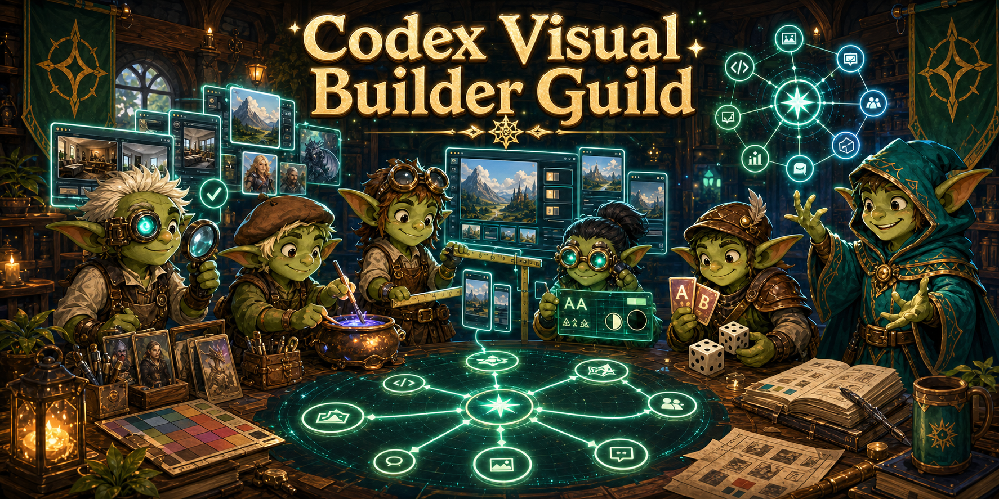
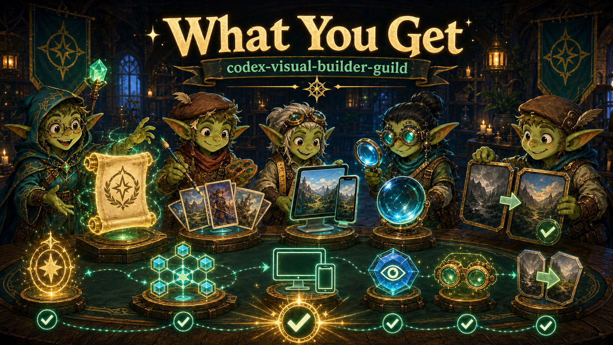
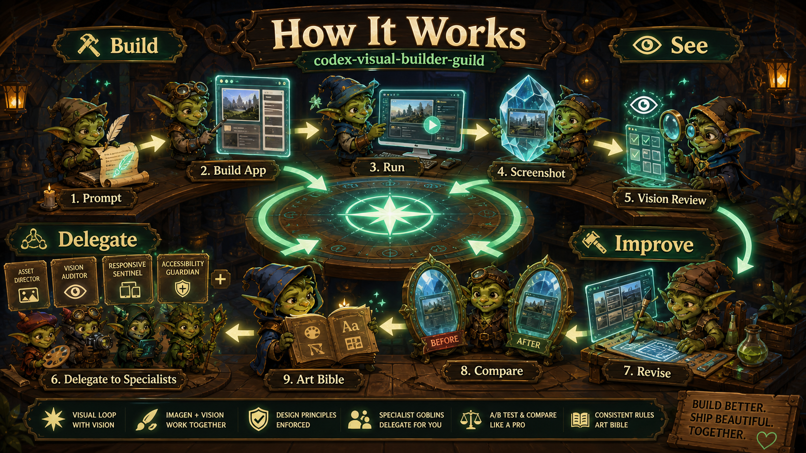
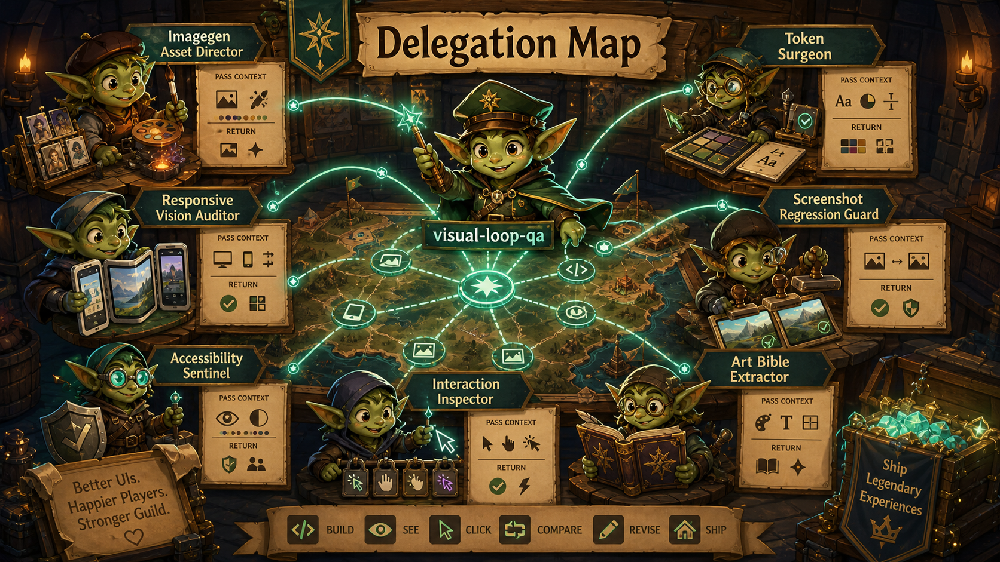
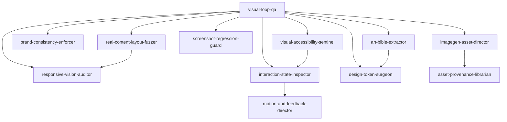
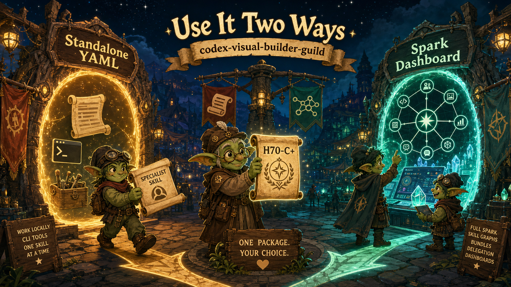
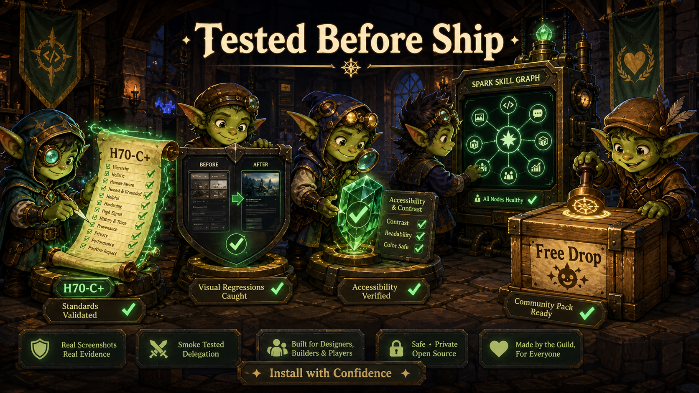

# codex-visual-builder-guild



A free H70-C+ Spark Skill Graphs guild for Codex Desktop visual product building.

Install this when you want Codex to stop guessing at UI from code alone and start working like a visual product team: generate assets, run the app, capture screenshots, inspect with vision, delegate to specialists, revise, compare, and preserve the winning design rules.

Free community drop. MIT licensed. Fork it, remix it, copy the skills into your own Spark graph, or use the YAML directly in your own agent runtime.

```text
prompt -> build -> run -> screenshot -> vision review -> specialist delegation -> revise -> compare -> extract rules
```

## What You Get



- 16 H70-C+ design skills for Codex visual builder loops.
- A ready bundle load order for Spark Skill Graphs.
- Explicit `delegates_version: 2` contracts so specialists know what context to pass and what to return.
- Practical coverage for screenshots, responsive states, interaction states, imagegen assets, accessibility, brand consistency, design tokens, and visual regressions.
- Standalone YAML files that can be used outside Spark.
- Validation and smoke tests so people can install with confidence.

## How It Works



Imagegen creates source material. Vision judges the rendered product. The guild turns that pair into a repeatable visual loop:

1. Build or modify the UI.
2. Run it locally.
3. Capture desktop and mobile screenshots.
4. Inspect layout, hierarchy, contrast, copy fit, responsive behavior, and interaction states with vision.
5. Delegate specific failure classes to the right specialist.
6. Fix, recapture, compare, and keep the winning rules.

## Delegation Map



The guild is hub-and-specialist by design:

- `visual-loop-qa` owns orchestration and final visual judgment.
- Specialists own narrow failure classes.
- Every handoff carries `pass_context`, `expect_back`, and `sla`.
- Winners become art bibles, design tokens, or screenshot baselines so taste does not evaporate.



## Use It Two Ways



**Standalone YAML**: load any file in `design/*.yaml` directly into an agent, prompt system, CLI tool, or custom runtime. Each skill is self-contained: identity, responsibilities, disasters, anti-patterns, production patterns, testing, decisions, recovery, examples, gotchas, and delegation contracts all live in the YAML.

**Spark Skill Graphs**: copy the same files into a Spark Skill Graphs checkout. `design/*.yaml` become graph nodes, `delegates` become graph edges, and `bundles/codex-visual-builder-loop.yaml` becomes the recommended guild load order.

## Tested Before Ship



This package includes local checks for the parts that matter most:

- H70-C+ structure
- required 12-section coverage
- embedded disaster detection commands
- embedded anti-pattern detection
- delegate contract completeness
- bundle load order resolution
- common Codex visual-loop invocation cues

## Core Guild

- `visual-loop-qa`: router and visual QA orchestrator
- `imagegen-asset-director`: UI-ready generated asset direction
- `responsive-vision-auditor`: viewport truth across mobile, tablet, desktop, and wide screens
- `interaction-state-inspector`: hover, focus, modal, dropdown, loading, error, and keyboard states
- `brand-consistency-enforcer`: cross-screen product language consistency
- `art-bible-extractor`: screenshot-derived visual rules
- `design-token-surgeon`: durable tokens and component contracts
- `screenshot-regression-guard`: before/after visual baselines
- `real-content-layout-fuzzer`: ugly real data stress states
- `visual-accessibility-sentinel`: contrast, focus, tap target, colorblind, and motion safety

## Optional Specialists

- `ab-visual-lab`
- `hero-image-cinematographer`
- `saas-dashboard-operator`
- `game-ui-polish`
- `motion-and-feedback-director`
- `asset-provenance-librarian`

## Install Into Spark Skill Graphs

From this repo root:

```powershell
Copy-Item -Recurse -Force .\design\*.yaml C:\Users\USER\Desktop\spark-skill-graphs\design\
Copy-Item -Force .\bundles\codex-visual-builder-loop.yaml C:\Users\USER\Desktop\spark-skill-graphs\bundles\
```

Then validate from `spark-skill-graphs`:

```powershell
$env:NODE_PATH='C:\Users\USER\Desktop\spawner-ui\node_modules'
$env:SPAWNER_H70_SKILLS_DIR='C:\Users\USER\Desktop\spark-skill-graphs\design'
node C:\Users\USER\Desktop\spark-skill-graphs\tools\validate-h70-cplus.js
```

If you use the Spark MCP server or dashboard, restart/re-index it after copying the files. Already-running MCP/dashboard processes may keep an older in-memory skill index and return `Skill not found` until restarted.

Recommended Spark-side checks:

```powershell
npm run validate
npm run validate:bundles
npm run validate:v2
node bin\sparkgraph.cjs recommend "Codex Desktop visual design loop with imagegen assets screenshots responsive vision QA interaction states screenshot regression" --limit 10
```

## Validate This Package

```powershell
npm install
npm run validate
npm run smoke
```

Expected result:

```text
Valid H70-C+: 16
Invalid: 0
With warnings: 0
```

The smoke test checks that:

- the bundle load order resolves
- every `delegates_version: 2` contract has context and expected output
- delegate targets resolve against the package plus a Spark Skill Graphs checkout
- `visual-loop-qa` contains the practical Codex loop cues: run, screenshot, vision, delegate, recapture, before/after
- keyword invocation routes common tasks to the expected specialists

## Infographic Set

- `assets/hero-guild-banner.png`: X and README hero
- `assets/what-you-get.png`: install value
- `assets/how-it-works.png`: visual builder loop
- `assets/delegation-map.png`: specialist routing
- `assets/use-it-two-ways.png`: standalone plus Spark dashboard usage
- `assets/tested-before-ship.png`: validation and trust
